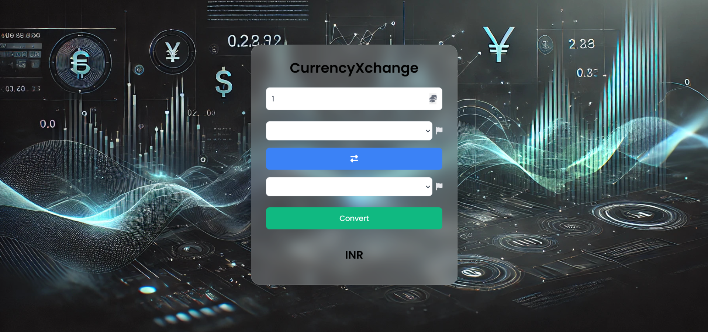

# 🌍 CurrencyXchange 💱



<br />

CurrencyXchange is a powerful yet simple currency converter web application built using **AngularJS**. It provides **real-time exchange rates** from the Exchange Rate API, allowing users to convert between multiple currencies quickly and efficiently.  

🔹 **Live exchange rate updates**  
🔹 **Secure API key handling**  
🔹 **User-friendly interface**  
🔹 **Lightning-fast conversions**  

## ✨ Features  

✅ **Real-time exchange rate conversion**  
✅ **Supports 100+ currencies**  
✅ **Easy-to-use currency selection**  
✅ **Responsive and mobile-friendly UI**  
✅ **Secure API key management with `.env`**  

---

## 🛠️ Tech Stack  

- **Frontend:** AngularJS, HTML, CSS  
- **API:** Exchange Rate API  

---

## 🚀 Installation  

###  Clone the Repository  
```sh
git clone https://github.com/rahull0328/CurrencyXchange.git
cd CurrencyXchange
```
---

## 🔒 Secure API Key Storage in `config.js`

To keep your API key secure and prevent accidental exposure, follow these steps:

## Step 1: Create `config.js`
Inside your project folder, create a new file named **`config.js`** and add the following content:

```javascript
const config = {
    apiKey: "YOUR_API_KEY_HERE"
};
```

## Step 2: Add the following code to **`app.js`**
```javascript
const apiKey = config.apiKey;
```

## Step 3: Add **`config.js`** inside **`index.html`** before AngularJS Script Tag

```html
<script src="./assets/config.js"></script>
```